# Forth Day 1998

Screenshots of overheads from Forth Day 1998 video.
VERY hard to read. :-(

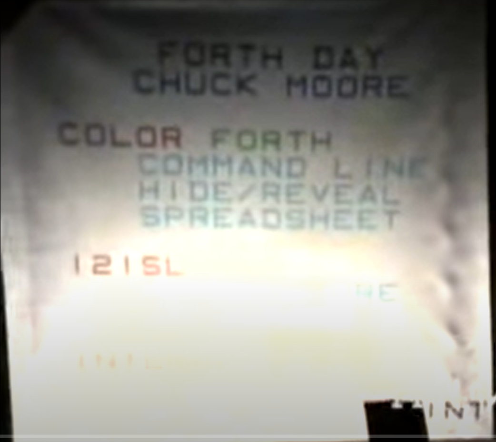

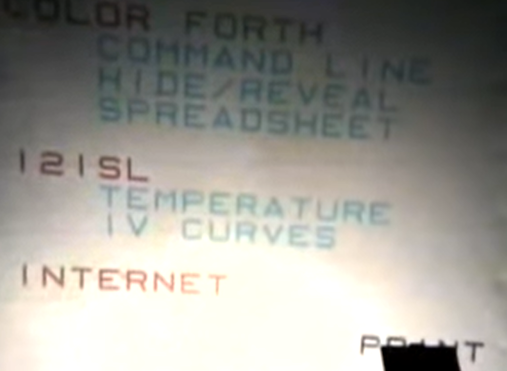

Apparent conventions:

* REMEMBER
   * Seems to make next word a does word?
* END marks end of block
* - is negate
* -1 + is used to decrement
* Makes use of fall thru
* VARIABLE switches red to mean define variable
   * : goes back
* Color
   * Red = Define
   * Green = Compile
   * Black = Execute (also mentions yellow?)
   * Blue = Comment?
   * Cyan = Unsure, a hex constant?

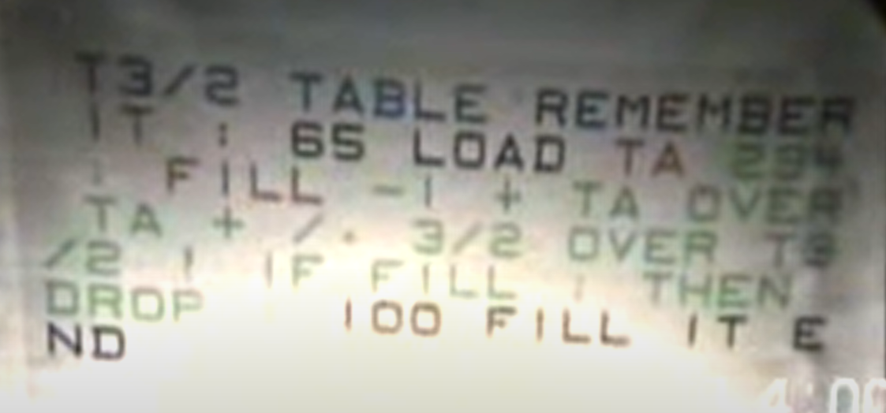

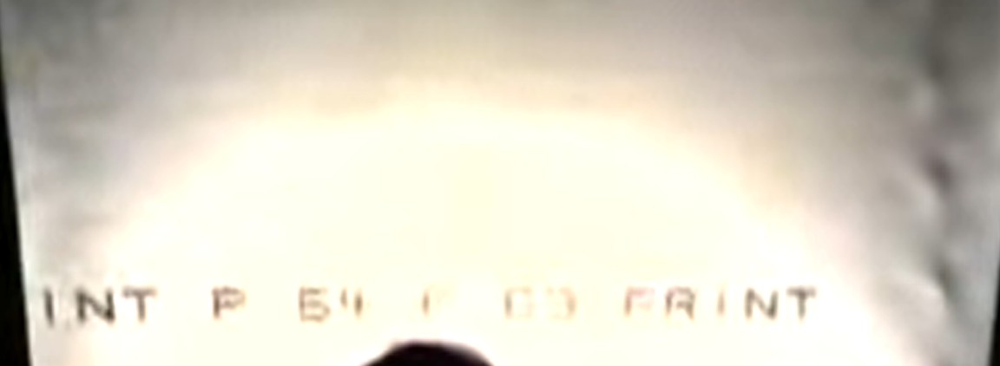

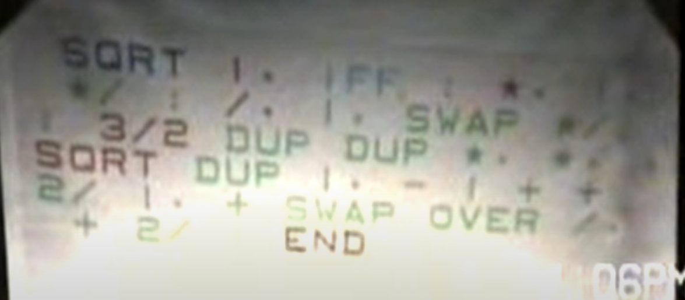

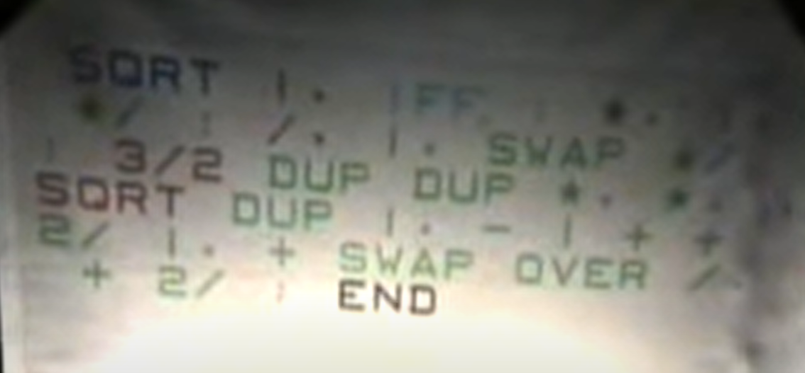

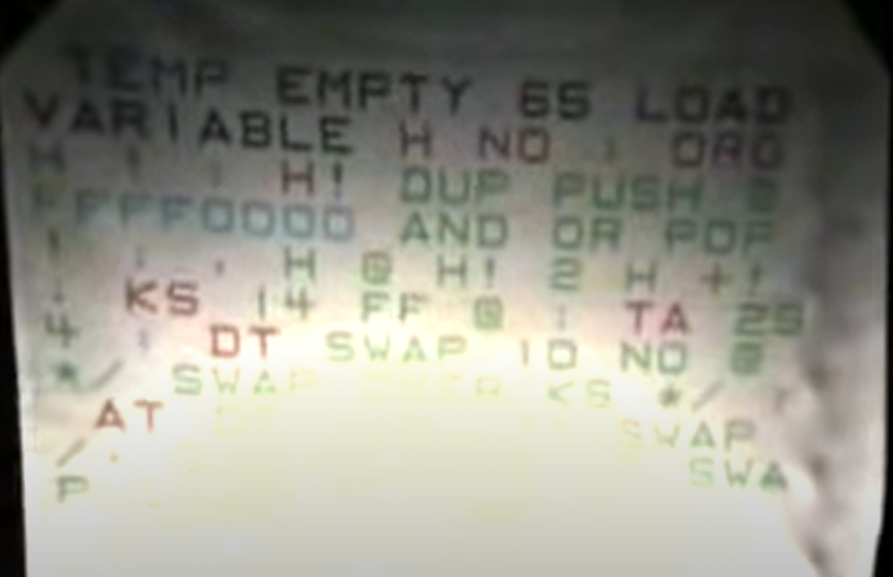

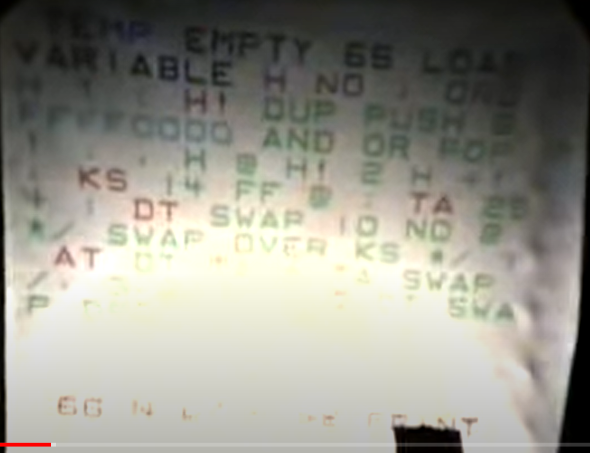

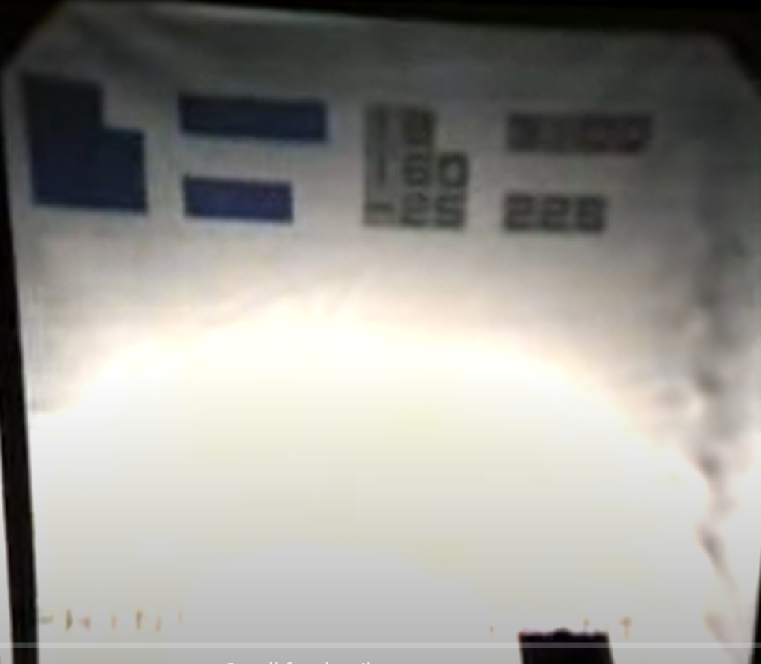

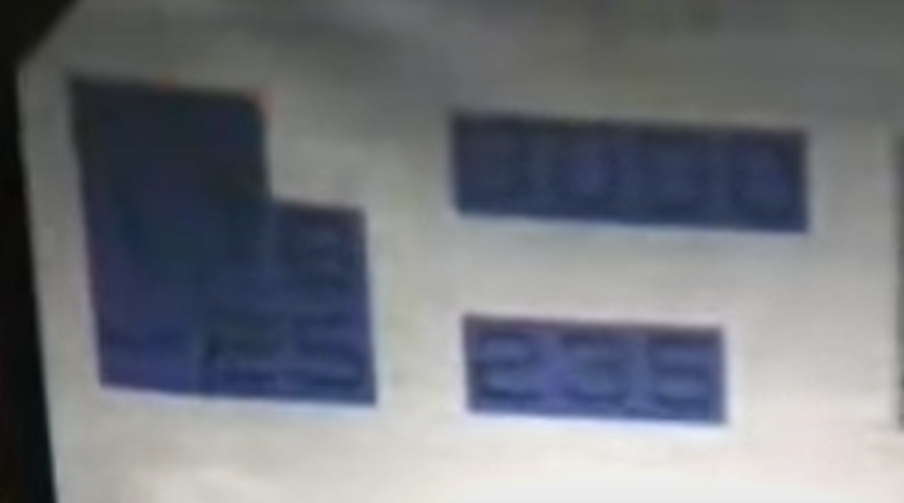

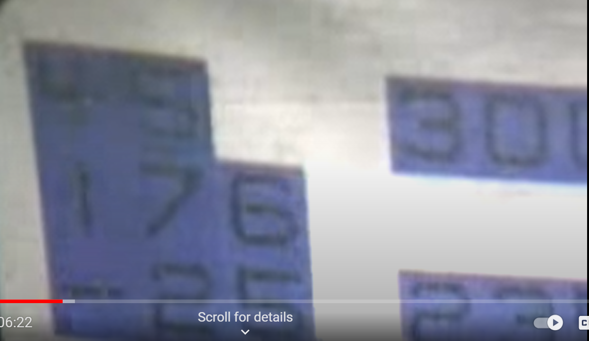

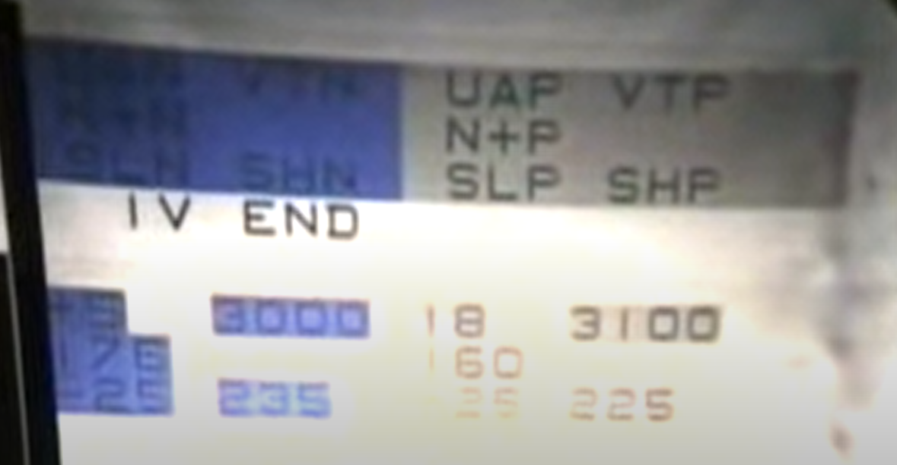

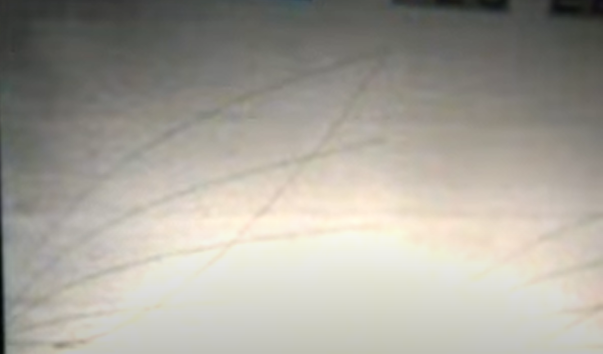

