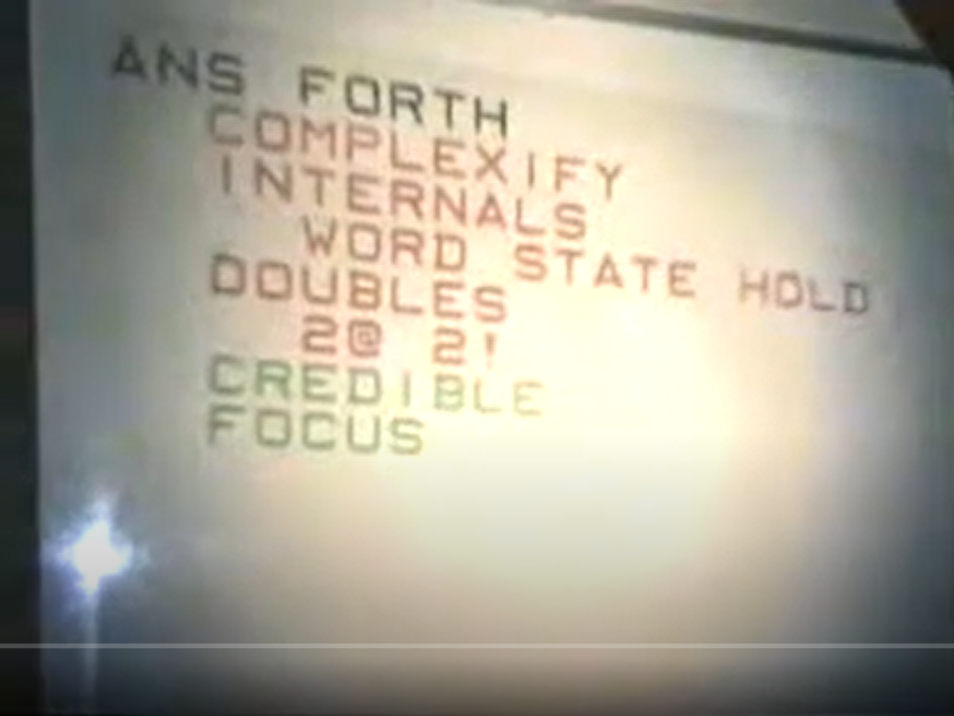

# Fireside Chat 1999

* iTV still a thing
* May 22, 1999 (according to video inset)

* ANSFORTH
   * COMPLEXIFY
   * INTERNALS
      * WORD STATE HOLD
   * DOUBLES
      * 2@ 2!
   * CREDIBLE
   * FOCUS

* MACHINE FORTH
   * ADDRESS REG
      * @+ !+
   * SDRAM

* COLOR FORTH
   * F1-F5 (green, red, blue)
      * Space in front in better
      * Able to determine the right thing to do
   * EDITOR!
   * ICE
   * 4x3 STACK
   * JUMP TABLE

* ICE
   * Interpret
   * Compile
   * Execute
   * (different than C)

* .BMP

* Questions
   * TSMC, something
   * Make Okad hierarchical
   * What are you gonna do with colorforth?
      * Put it online, it'll fit on a floppy
   * It's not in the nature of software it needs to be big
      * Small team could replicate MS software in a year
   * User illusion - make the computer look different than it really is
      * Want to dispell the user illussion
   * Forth Logo

