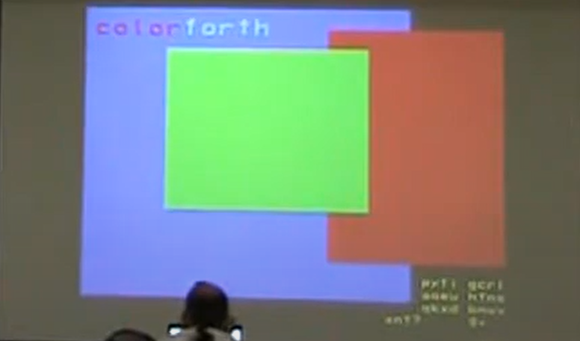
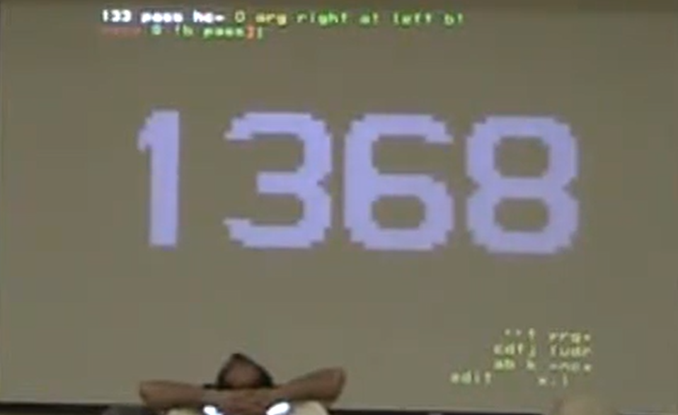

# Forth Day 2008

* At Cogswell
* Go through 33 instructions in C18 instruction set
* 30th anniversary Forth
* Found out shuttle run charge the same up to some limit (hence 144)
* iTV still a thing
* May 22, 1999 (according to video inset)

