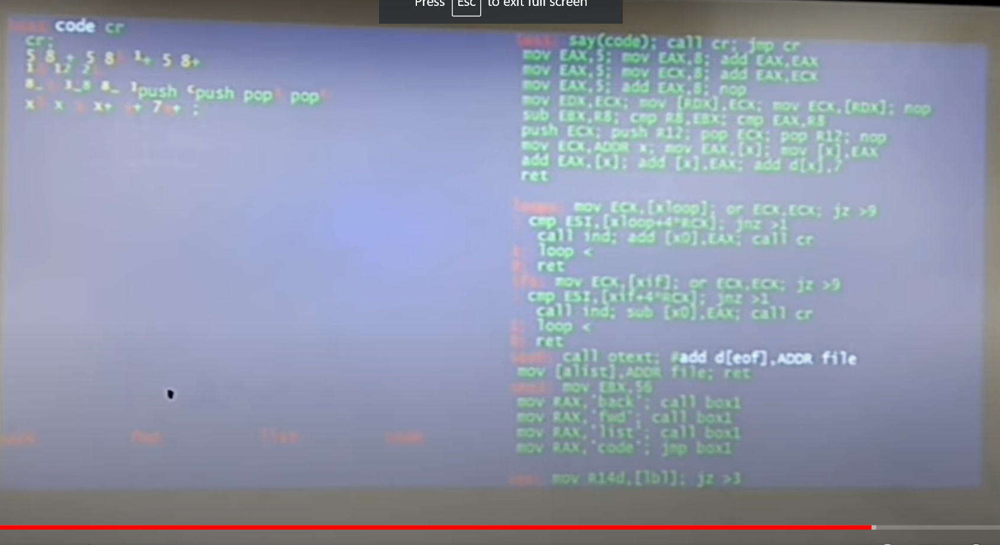
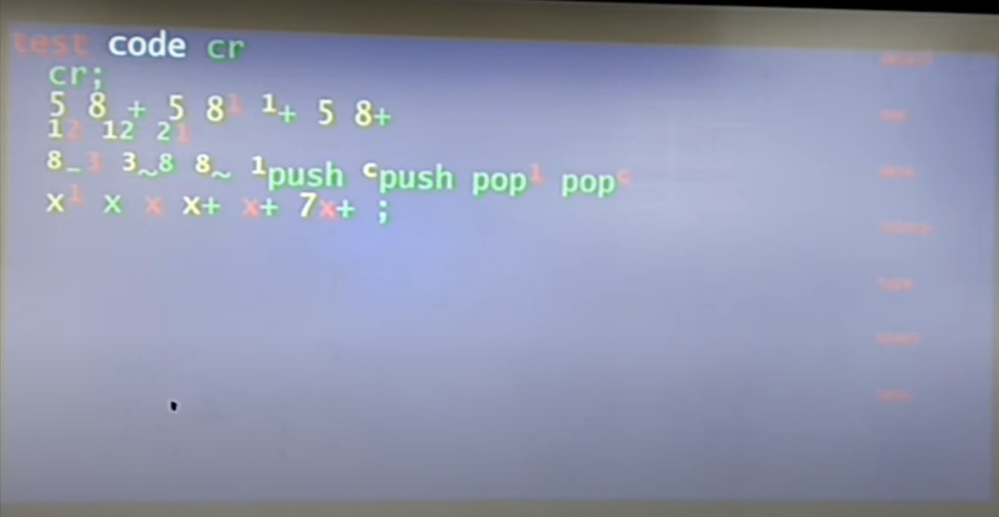
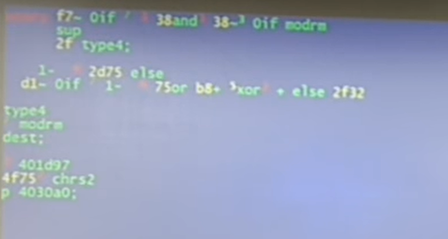
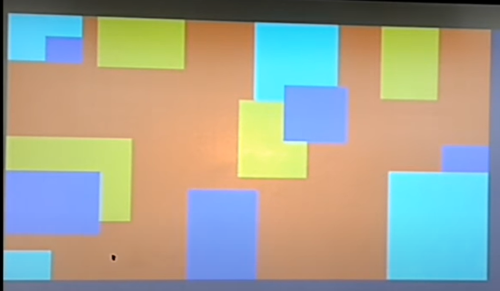
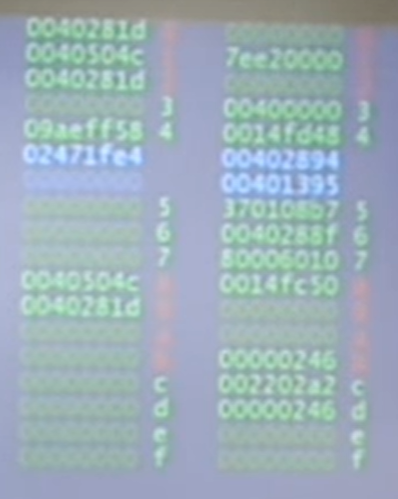
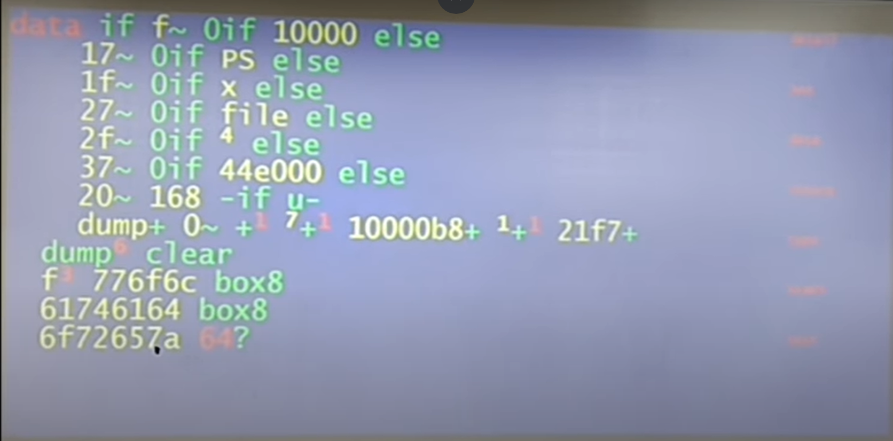
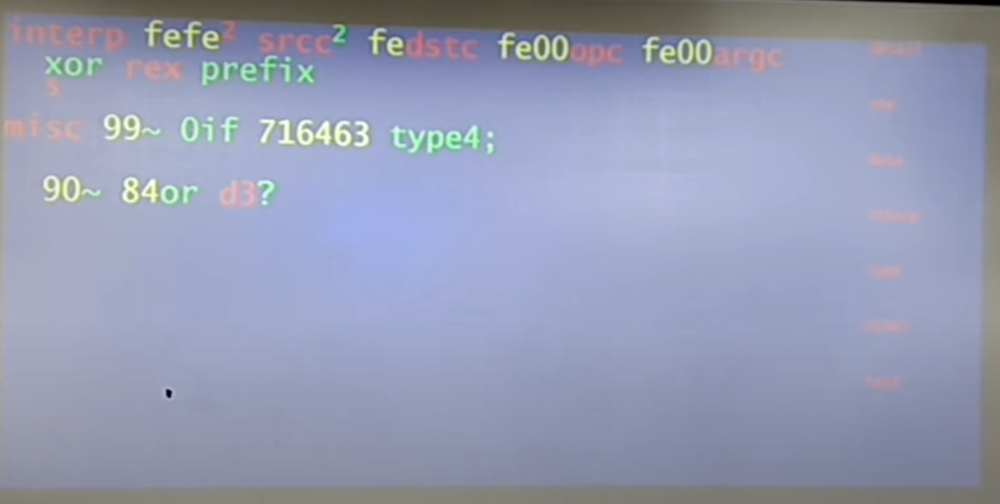

# Forth Day 2017

* [video](https://youtu.be/nJ6WBI0Z_s4?t=11091)
* messing around with computers:
   * 3D graphics
   * internet browser
   * USB drivers
   * audio processing
   * parallel processing
* disassemble machine code into Forth
   * platform: language
   * GA144: colorForth
   * iPhone: Swift
   * mac Mini: Swift
   * Raspberry Pi: Raspbian
   * PC: GoAsm
* Raspberry Pi
   * Couldn't figure out how to start threads
* Moved to the PC
   * GoAsm
* Windows
   * learned to:
      * read file
      * display image
      * play wav file
      * double buffer display
      * create icon
      * create thread
   * haven't:
      * read microphone
      * read temperature
      * access internet
      * readched GPU
* Shows system running on windows
   * Lots of apps
   * includes decompiler
   * Flags
   * Clock
* Figure out which areas of memory accessible by trial and error
* Symbol table
* Decompile display
   * colorForth like with super/subscripts
   * Decompile a register machine
   * Register copy, register add
* Random number generator + visualizations
* ~ for comparison
* Register oriented Forth
* Is there a future in this, I doubt it
* Is trying to help me learn the instruction set
* Questions?
   * Tempted to design own font with superscripts

